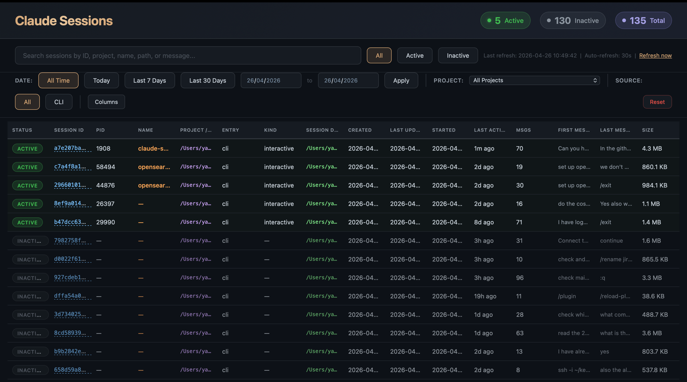
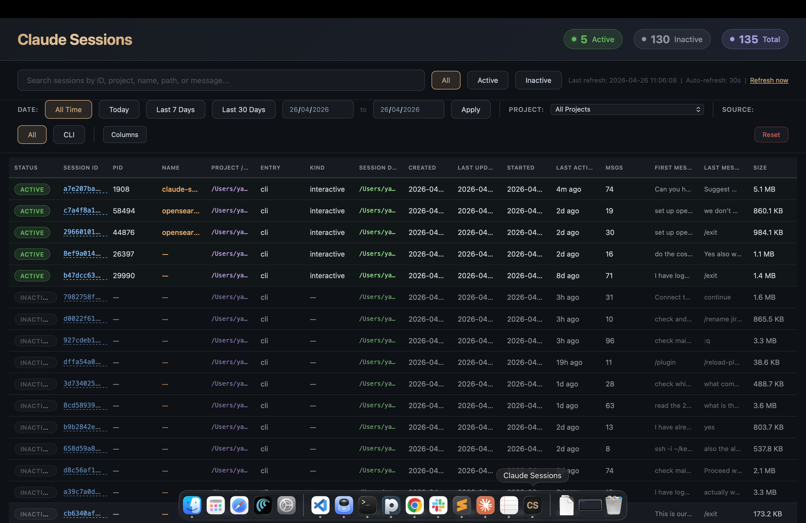
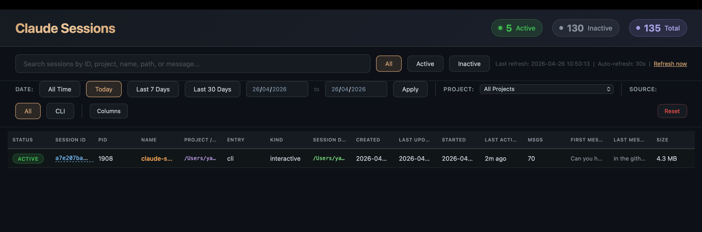
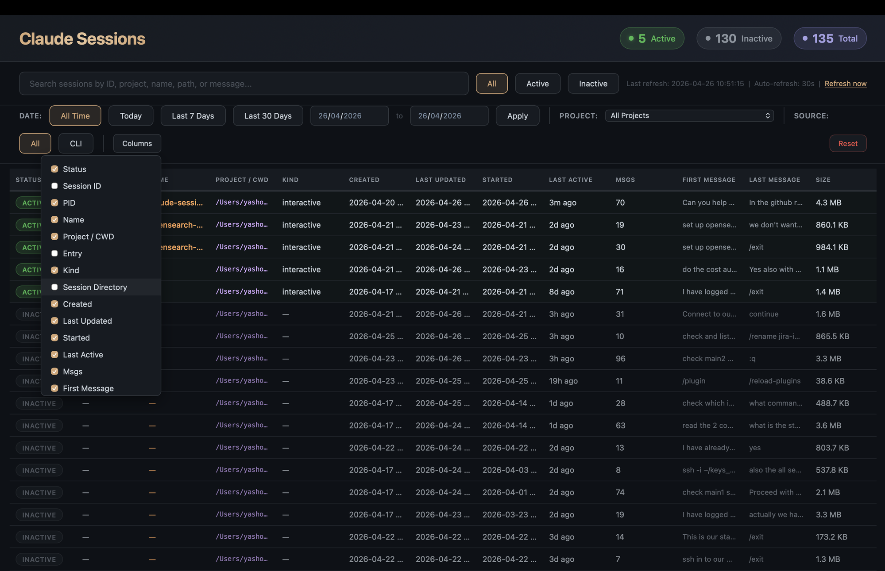
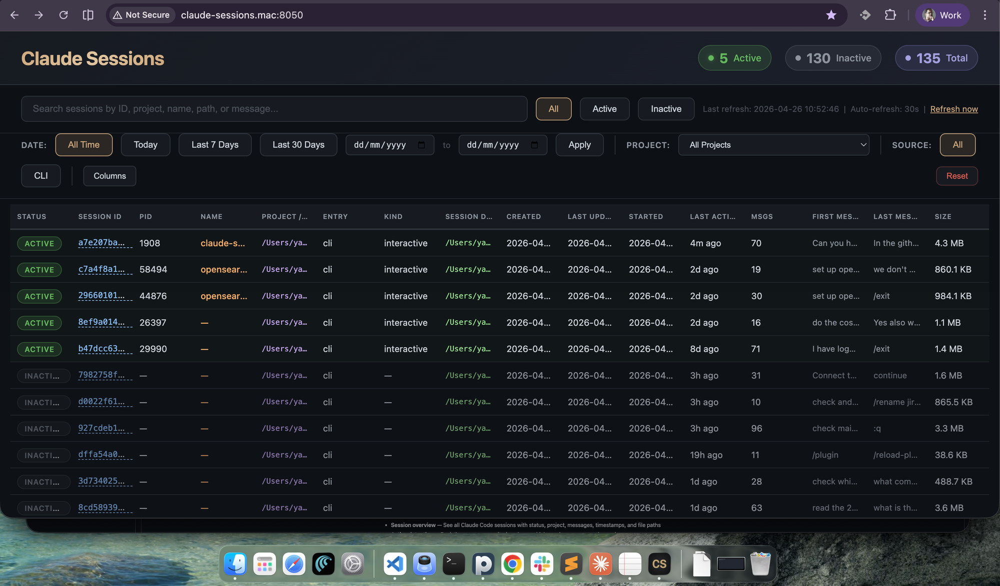

# Claude Sessions Dashboard

A local web dashboard to view, search, and manage all your [Claude Code](https://claude.ai/claude-code) sessions — both active and inactive.

### Dashboard Overview


### Native macOS App


### Filters and Search


### Column Visibility Toggle


### Local Web Application


## Features

- **Session overview** — See all Claude Code sessions with status, project, messages, timestamps, and file paths
- **Active detection** — Real-time process monitoring shows which sessions are currently running
- **Search** — Full-text search across session ID, project path, name, and messages
- **Filters** — Filter by status (active/inactive), date range, project, and source (CLI/Desktop)
- **Click to resume** — Click any session ID to copy the `claude --resume` command, or click the play button to open Terminal directly
- **Column resizing** — Drag column edges to resize any column
- **Column visibility** — Show/hide columns via the Columns dropdown
- **Column sorting** — Sort by any column
- **Auto-refresh** — Dashboard refreshes every 30 seconds
- **JSON API** — Programmatic access at `/api/sessions`
- **Dark theme** — Matches the Claude Code aesthetic
- **Native macOS app** — Optional native wrapper with menu bar icon
- **Zero dependencies** — Uses only Python standard library

## Requirements

- **Python 3.8+**
- **macOS** or **Linux** (macOS recommended for full feature set including Terminal launcher)
- **Claude Code** installed with session data in `~/.claude/`

## Installation

### Option 1: pip (recommended)

```bash
pip install claude-sessions-dashboard
```

Then run:

```bash
claude-sessions
```

### Option 2: From source

```bash
git clone https://github.com/Yashokeerti/claude-sessions-dashboard.git
cd claude-sessions-dashboard
make run
```

### Option 3: Direct run (no install)

```bash
git clone https://github.com/Yashokeerti/claude-sessions-dashboard.git
cd claude-sessions-dashboard
python -m claude_sessions_dashboard
```

### Option 4: Homebrew (macOS)

```bash
brew tap Yashokeerti/claude-sessions-dashboard
brew install claude-sessions-dashboard
```

Then run:

```bash
claude-sessions
```

### Option 5: Native macOS app

```bash
git clone https://github.com/Yashokeerti/claude-sessions-dashboard.git
cd claude-sessions-dashboard
make build-mac
```

This compiles a native macOS app and installs it to `~/Applications/`. Launch it from Spotlight, Finder, or the Dock.

## Usage

### Web dashboard

```bash
# Default port 8050
claude-sessions

# Custom port
claude-sessions --port 9090

# Run as module
python -m claude_sessions_dashboard --port 8050
```

Open http://localhost:8050 in your browser.

### Optional: Custom local domain

Add to `/etc/hosts` for a friendly URL:

```bash
sudo sh -c 'echo "127.0.0.1 claude-sessions.mac" >> /etc/hosts'
```

Then access at http://claude-sessions.mac:8050

### macOS native app

After building with `make build-mac`:

- Launch from **Spotlight**: search "Claude Sessions"
- Launch from **Dock**: drag from `~/Applications/`
- Launch from **Terminal**: `open ~/Applications/Claude\ Sessions.app`

The app runs a menu bar icon with options to open/refresh/restart the dashboard.

### API

```bash
# Get all sessions as JSON
curl http://localhost:8050/api/sessions
```

## Data sources

The dashboard reads from these local Claude Code data locations (all under `~/.claude/`):

| Source | Path | Data |
|--------|------|------|
| Active sessions | `~/.claude/sessions/*.json` | PID, session ID, cwd, start time |
| History | `~/.claude/history.jsonl` | Messages, timestamps, project |
| Project sessions | `~/.claude/projects/*/` | Conversation logs, file sizes |
| Session env | `~/.claude/session-env/` | Session environment data |

All data is read-only and never leaves your machine.

## Project structure

```
claude-sessions-dashboard/
├── src/claude_sessions_dashboard/
│   ├── __init__.py          # Package metadata
│   ├── __main__.py          # python -m entry point
│   └── dashboard.py         # Main server and dashboard
├── macos/                   # Native macOS app
│   ├── ClaudeSessions.swift # Swift WebView wrapper
│   ├── Info.plist           # App bundle config
│   ├── build.sh             # Build script
│   └── AppIcon.icns         # App icon
├── Formula/                 # Homebrew formula
├── assets/                  # Icons and images
├── pyproject.toml           # Python packaging
├── Makefile                 # Build commands
└── README.md
```

## Development

```bash
# Clone
git clone https://github.com/Yashokeerti/claude-sessions-dashboard.git
cd claude-sessions-dashboard

# Install in development mode
pip install -e .

# Run
claude-sessions

# Build macOS app
make build-mac
```

## Contributing

Contributions are welcome! Please:

1. Fork the repository
2. Create a feature branch (`git checkout -b feature/your-feature`)
3. Commit your changes (`git commit -m 'Add your feature'`)
4. Push to the branch (`git push origin feature/your-feature`)
5. Open a Pull Request

## License

[MIT](LICENSE)
